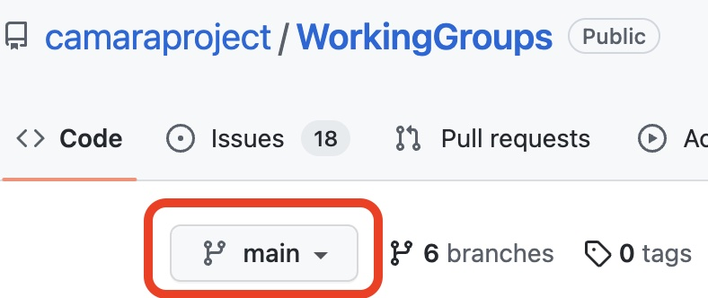
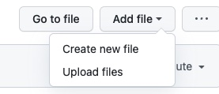
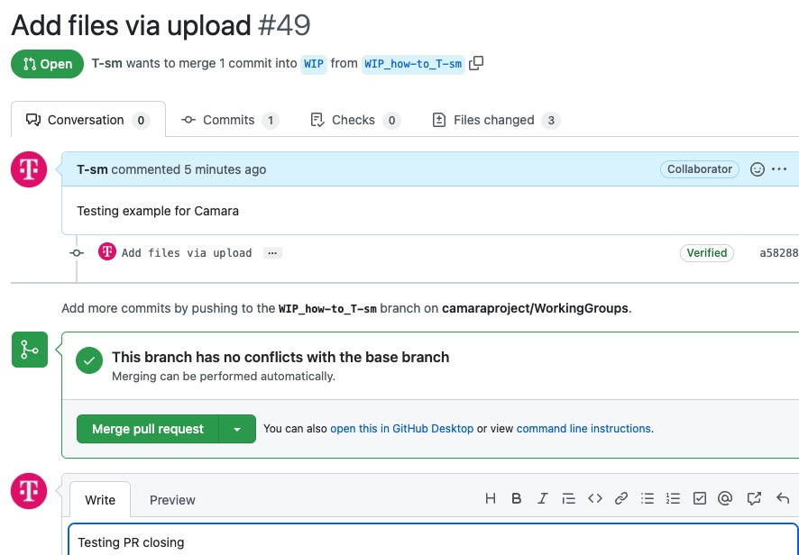

# CAMARA: How to use branches & pull requests

## Introduction

This short document aims to aid Camara collaborators with less git or GitHub experience. Since the official procedure for introducing changes in Camara relies on git branches and pull requests, the tutorial will focus on these subjects.
If you need a general basic and friendly introduction to git and GitHub, you are encouraged to watch the ["GitHub for poets"](https://www.youtube.com/watch?v=BCQHnlnPusY) series.

## About branches

Branches allow you to develop features, fix bugs, or safely experiment with new ideas in a contained area of our repository. If you need a friendly video introduction to git branching, please try [part two of "GitHub for Poets"](https://www.youtube.com/watch?v=oPpnCh7InLY) on Youtube, you may also read GitHub's "[Creating and deleting branches within your repository](https://docs.github.com/en/articles/creating-and-deleting-branches-within-your-repository)" for a deep dive.

### Walkthrough: Switching between Camara branches

1. Click the drop down at the top of the file list that says **main**.
2. Type or select a branch name, e.g. `RTR`, into the text box.
3. Voilá, you now see the files "hidden" under the non-default branch.

You may also click on the number of branches next to the branch list to see details of all the branches or create a new branch:

All Camara's subprojects and Working Groups have to work with 4 branches to reflect the status of the artifacts (API descriptions, API code, documentation, etc.):

* *CON* Branch for contributions
* *WIP* Branch for work-in-progress
* *RTR* Branch for artifacts which are ready-to-review
* *main* Branch for deliverables which can be shared externally

All contributions (e.g. initial files, tools, templates) to CAMARA have to be made only to the CON branch. If Project participants intend to start working on an topic first they have to copy the respective artifacts to the WIP branch. The original copy of the artifacts is kept in the CON branch.

In the WIP branch the real work takes place. If artifacts get ready for review these have to be copied from the WIP branch to the RTR branch and removed from WIP.

In the RTR branch the review and inclusion of findings takes place. If artifacts are accepted by the Sub Project or Working Group these have to be moved/merged to the main branch.

## About pull requests

For adding modifications to a branch in Camara, a pull request has to be initiated. When you open a pull request, you're proposing your changes and requesting that someone review and pull in your contribution and merge them into their branch. Pull requests show diffs, or differences, of the content from both branches. The changes, additions, and subtractions are shown in different colors.

Anyone with read access to a repository can create a pull request. You can specify which branch you'd like to merge your changes into when you create your pull request.
You can link a pull request to an issue to show that a fix is in progress and to automatically close the issue when someone merges the pull request (see "[Linking a pull request to an issue](https://docs.github.com/en/github/managing-your-work-on-github/linking-a-pull-request-to-an-issue)").

For more information on PRs (pull requests) watch the third episode of ["GitHub for Poets"](https://www.youtube.com/watch?v=_NrSWLQsDL4). For a deep dive, see GitHub's docs:

* [About pull requests](https://docs.github.com/en/pull-requests/collaborating-with-pull-requests/proposing-changes-to-your-work-with-pull-requests/about-pull-requests)
* [Propose changes](https://docs.github.com/en/pull-requests/collaborating-with-pull-requests/proposing-changes-to-your-work-with-pull-requests "Propose changes")
* [Collaborate with pull requests](https://docs.github.com/en/pull-requests/collaborating-with-pull-requests "Collaborate with pull requests")

### Creating a pull request in Camara

[Create a pull request](https://docs.github.com/en/pull-requests/collaborating-with-pull-requests/proposing-changes-to-your-work-with-pull-requests/creating-a-pull-request) to propose and collaborate on changes to a repository. These changes are proposed in a *branch*, which ensures that the default branch only contains finished and approved work.

Please name such a new branch in Camara with a standardized naming: *target-branch\_target-subject\_user*. This will improve the readability when multiple pull requests (PRs) are in progress and, therefore, the number of branches increases.

As soon as you make a commit, you can open a pull request and start a discussion. By using GitHub's `@mention` feature in your pull request message, you can ask for feedback from specific people.

### Walkthrough: adding new files to `WIP` with a PR

1. Switch to the `WIP` branch in a Camara repository.
2. Move to the directory you want to upload or add your files.
3. Click **add file** and either create or upload files: 
4. In the **Commit changes** box, select *create a new branch for this commit and start a pull request*. Please name such a new branch in Camara with a standardized naming: *target-branch\_target-subject\_user*.

5. The *Open a pull request* form appears. Please write a relevant description, verify the target branch (`WIP` in this example) and press *Create pull request*.

Similarly, it is possible to create a pull request if there is already a branch with proposed changes:

### Walkthrough: PR for an existing branch into WIP

1. Click the **Pull requests** tab of a Camara repository.
2. Click **New pull request**
3. In the **Example Comparisons** box, select the branch you made to compare with `WIP`.
4. Look over your changes in the diffs on the Compare page, make sure they're what you want to submit.
5. Click **Create pull request**.
6. Give your pull request a title and write a brief description of your changes. You can include emojis and drag and drop images and gifs.
7. Optionally, to the right of your title and description, click the  next to **Reviewers**. **Assignees**, **Labels**, **Projects**, or **Milestone** to add any of these options to your pull request. You do not need to add any yet, but these options offer different ways to collaborate using pull requests. For more information, see "[About pull requests](https://docs.github.com/en/pull-requests/collaborating-with-pull-requests/proposing-changes-to-your-work-with-pull-requests/about-pull-requests)."
8. Click **Create pull request**.

Camara workgroup moderators can now review your edits and merge the PR into the target branch. Comments may be made, both in case of merging as in the case of closing a request without incorporating changes into one of the branches.

**Tip**:

* Using the compare view, you can set up comparisons across any timeframe. For more information, see "[Comparing commits](https://docs.github.com/en/pull-requests/committing-changes-to-your-project/viewing-and-comparing-commits/comparing-commits)."
